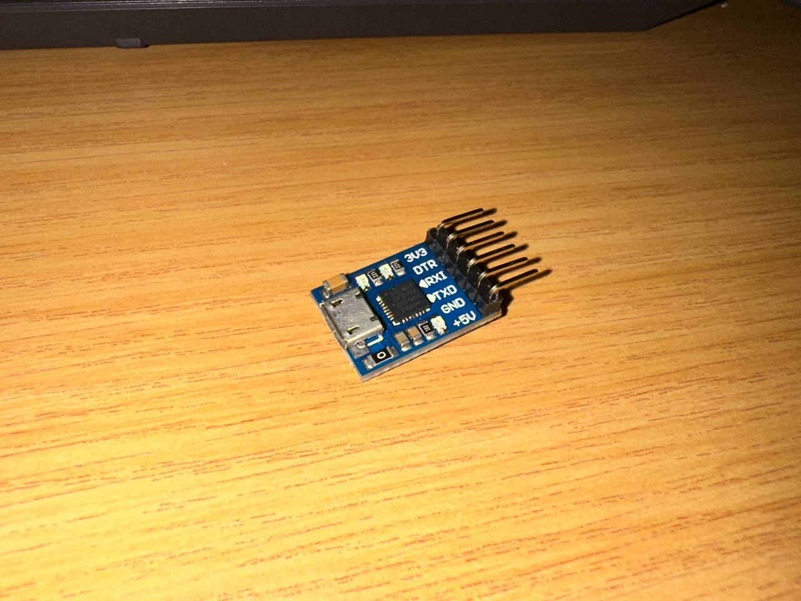
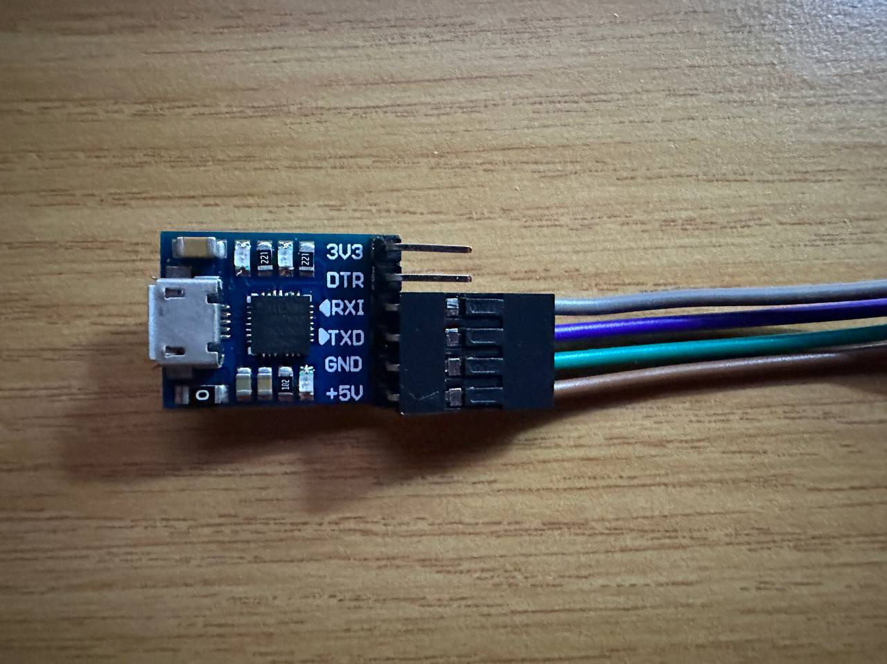
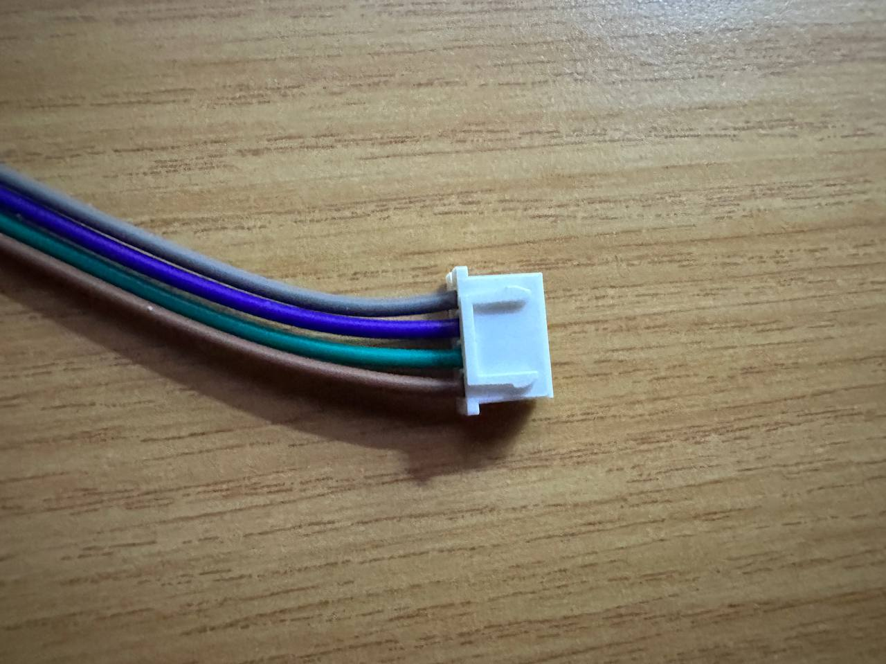
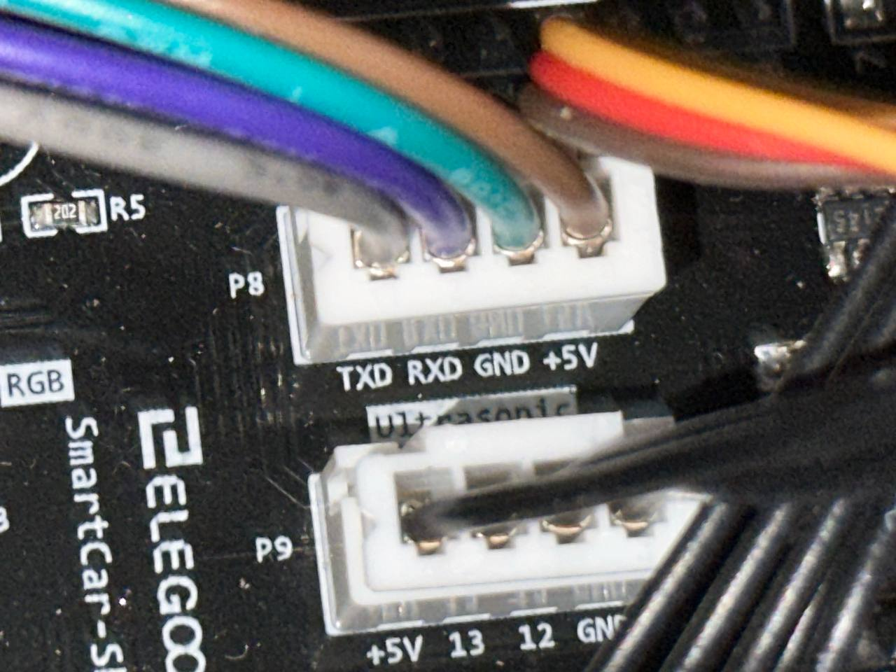
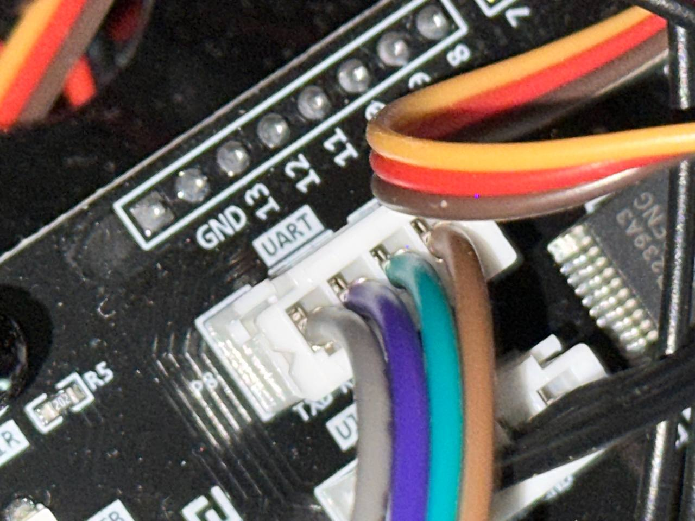
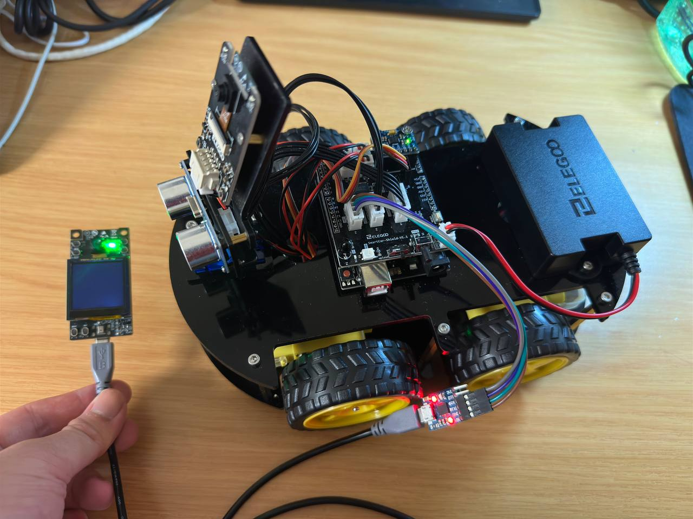

# Elegoo-AI-Robot

This project ties an existing TensorFlow Lite Micro AI Model to Elegoo's Smart Robot v4.0 using the ESP32-S3-EYE development board. It detects a face with the camera and makes the robot move accordingly.

This project is based off existing code, primarily [bertmelis/USBHostSerial](https://github.com/bertmelis/USBHostSerial) and [espressif/esp-tflite-micro/examples/person_detection at master](https://github.com/espressif/esp-tflite-micro/tree/master/examples/person_detection). Both codebases have been modified to work with each other to grab data from the AI Model and pass the output over serial. These changes have been highlighted in the source code as comments with the word `MODIFICATION`.

## Software Dependencies

All dependencies have been already added to [idf_component.yml](https://github.com/henrytran720/Elegoo-AI-Robot/blob/main/main/idf_component.yml) and should be automatically downloaded upon compile, but for reference, here are all the dependencies this project requires:

- [Espressif TinyUSB fork](https://components.espressif.com/components/espressif/tinyusb)
- [Espressif's additions to TinyUSB](https://components.espressif.com/components/espressif/esp_tinyusb)
- [USB Host CDC-ACM Class Drive](https://components.espressif.com/components/espressif/usb_host_cdc_acm/versions/2.0.3)
- [Virtual COM Port Service](https://components.espressif.com/components/espressif/usb_host_vcp)
- [ESP32 Camera Driver](https://components.espressif.com/components/espressif/esp32-camera/)
- [TensorFlow Lite Micro for Espressif Chipsets](https://components.espressif.com/components/espressif/esp-tflite-micro/)
- [bertmelis' USBHostSerial](https://github.com/bertmelis/USBHostSerial)
- Serial device drivers (Technically you only need one but to save time all three have been included):
  - [CH34x USB-UART converter driver](https://components.espressif.com/components/espressif/usb_host_ch34x_vcp/versions/2.0.0)
  - [Silicon Labs CP210x USB-UART converter driver](https://components.espressif.com/components/espressif/usb_host_cp210x_vcp/versions/2.0.0)
  - [FTDI UART-USB converters driver](https://components.espressif.com/components/espressif/usb_host_ftdi_vcp/versions/2.0.0)

## Hardware Requirements

Here's what you'll need to buy to use this project:

* [Elegoo's Smart Robot Car Kit v4.0](https://us.elegoo.com/products/elegoo-smart-robot-car-kit-v-4-0)
* [Espressif ESP32-S3-EYE Development Board](https://www.aliexpress.us/item/3256803794751194.html)
* [CP2102 Micro USB to UART Converter](https://www.amazon.com/HiLetgo-CP2102-Module-Converter-Replace/dp/B01N47LXRA) (It doesn't need to be this exact converter, and any serial device will work so long as it is compatible with the drivers above)
* [JST XH to Dupont Connector Kit](https://www.amazon.com/Kidisoii-Dupont2-54-Connector-Pre-Crimped-Compatible/dp/B0CMCN9CXD/135-4941321-1839956) - This is so you can fabricate a cable that will connect the UART port on the Robot to the pins on the serial converter
* [Micro USB to Micro USB OTG Cable](https://www.amazon.com/Micro-USB-Male-Data-Cable/dp/B0872GMD7V/)
* USB-A/USB-C to Micro USB Cable - You'll need this to flash the ESP32-S3-EYE and communicate with the serial adapter for testing. A USB-A to Micro USB cable should have come with your robot for our purposes.

## Getting Started

### The basics

You will need to have the [ESP-IDF SDK](https://github.com/espressif/esp-idf) installed to get started. Installation instructions can be found [here.](https://docs.espressif.com/projects/esp-idf/en/stable/esp32s3/get-started/index.html#manual-installation) For this project I used version 5.3 of the SDK, however this code should work for future versions.

The ESP32-S3-EYE should have come with [default firmware](https://github.com/espressif/esp-who/blob/master/docs/en/get-started/ESP32-S3-EYE_Getting_Started_Guide.md#17-default-firmware-and-function-test) installed. Take some time to play around with it and test its basic functions, such as the camera, LCD, and microphone. Once our code is flashed to the ESP32-S3, only the camera and certain LEDs will function.

You may proceed to assembling the project once you've confirmed the ESP32-S3-EYE is fully functional.

### Assembly

You should already have the Elegoo Robot assembled. If not, please refer to the instruction booklets that came with your robot, or refer to the online instructions available at the end of this readme.

You should also have the serial adapter, the JST XH to Dupont kit, and the Micro USB to Micro USB cable. If you still need to get those, please refer back to [Hardware Requirements](<#Hardware Requirements>).

Depending on the serial adapter you ordered, you may need to solder the pins that came with it to the serial adapter so the Dupont end of the cable can have a solid connection. Here is what it should look like:



Now we fabricate our serial cable. Using the JST XH to Dupont kit, we can assemble a 4-pin cable that goes from JST XH to Dupont, which should look like this:





Unplug the existing camera from the UART port on the robot, and connect our new cable to the port. **Pay attention to the color of the cables!**





With the serial adapter connected, switch on the power to the robot. A red LED should be visible on the serial adapter, confirming that it is receiving power. You should now be able to communicate with the robot with a USB-A to Micro USB cable from your computer. Once connected, you should be able to issue commands such as:

```json
// The syntax for these commands will be explained at the end of this readme.
{'H':'Elegoo','N':1,'D1':0,'D2':50,'D3':1} // Commands the robot to turn its wheels clockwise with 50/255 power.
{'H':'Elegoo','N':1,'D1':0,'D2':0,'D3':1} // Commands the robot to stop turning its wheels.
```

If the robot does not respond to any of your commands, please make sure the switch on the robot's Arduino board located next to the USB-B port is set to `cam`, and try running the command again.


### Setup

Once you know the camera module works, go ahead and clone this repository to a folder of your choosing:

```sh
git clone https://github.com/henrytran720/Elegoo-AI-Robot.git
cd Elegoo-AI-Robot
```

From there, make sure you have the ESP-IDF environment running on your favorite terminal, whether it's CMD, PowerShell, bash, etc. You'll know it's working when you can run `idf.py` and you see something like this:

```
Usage: idf.py [OPTIONS] COMMAND1 [ARGS]... [COMMAND2 [ARGS]...]...

  ESP-IDF CLI build management tool. For commands that are not known to idf.py an attempt to execute it as a build
  system target will be made. Selected target: esp32s3

...
```

Speaking of selecting targets, we'll need to do that for this project. Run the following command:

```sh
# This will set up the project to be compiled for the ESP32-S3.
# If you're compiling this project for another platform, please set the target appropriately for your environment.
idf.py set-target esp32s3
```

You should see two new folders: `build`, and `managed_components`. These folders will be necessary to compile this project.

You will need to go into the IDF's menuconfig to change a certain setting.

```sh
idf.py menuconfig
```

You should then see a menu that looks like this:


Make sure `Compiler options -> Enable C++ exceptions` is enabled, then save and exit the menuconfig. You should now be ready to compile the project.

### Compiling

It's now time to flash our code. Make sure you have the ESP32-S3-EYE plugged in for this and run the following command:

```sh
# Will flash the project to the ESP32-S3-EYE.
# If the project hasn't been built or changes have been made, it will automatically be built before flashing.
idf.py flash
```

The build will take quite some time depending on your CPU. Once finished, you can unplug the ESP32-S3-EYE and plug it in to the serial adapter using the Micro USB to Micro USB cable.

## Final Product

Switch the power on to the robot and wait a few seconds. You should see at least one of the LEDs on both the serial adapter and the Arduino board flashing, indicating that the serial connection has been established and data is being transmitted.

Make sure you are in a lit environment, and bring the ESP32-S3-EYE to your face. The robot should begin moving. It will continue to do so as long as it can see your face.

Here is what the finished assembly should look like:



## Additional Resources

* [Smart Robot Car v4.0 Manual & Source Code](https://download.elegoo.com/?t=RobotCarV4.0)
* [Espressif ESP-IDF Programming Guide for the ESP32-S3-EYE](https://docs.espressif.com/projects/esp-idf/en/stable/esp32s3/index.html)
* [ESP32-S3-EYE Getting Started Guide](https://github.com/espressif/esp-who/blob/master/docs/en/get-started/ESP32-S3-EYE_Getting_Started_Guide.md)

### Command Syntax

Thanks to Elegoo providing an easy way to control their robot over serial, there are a lot of things that we can now do with the robot, including the commands demonstrated in [Assembly](#Assembly). Below is a basic explanation of the commands used in this project and how the syntax works.

```json
{
  "H": "Elegoo",    // This is the ID that gets passed to the robot. This value can be whatever you choose and is required on almost all commands.
  "N": 1,           // "N" selects the command that gets executed on the robot.
  "D1": 0,          // Paramater 1. This selects the motors that you wish to control. 1 = All motors, 2 = Left motors, 3 = Right motors.
  "D2": 50,         // Parameter 2. This sets the speed of the motor, and has an acceptable value of 0-255.
  "D3": 1           // Parameter 3. This sets the rotation direction of the wheels. 1 = Clockwise, 2 = Counterclockwise.
}
```

Additional commands and instructions can be found in the robot's online manual.

## License

TensorFlow and Espressif's sample code is covered by the Apache 2.0 license.

bertmelis' USBHostSerial code is covered by the MIT license.

Modifications made to both codebases for this project are also covered by the included MIT license.

